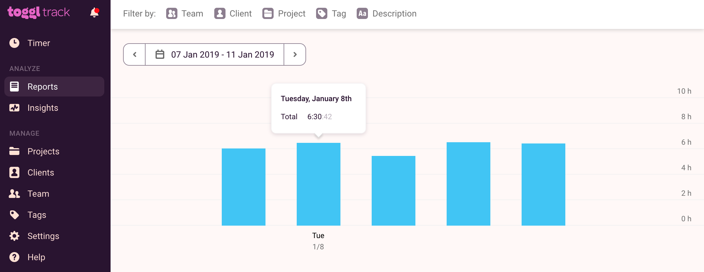
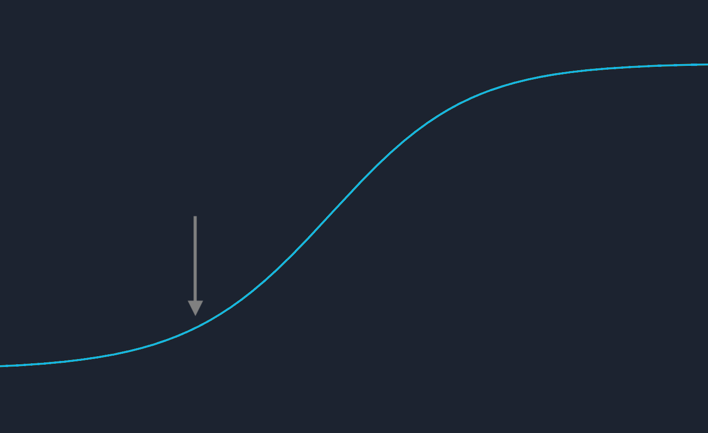
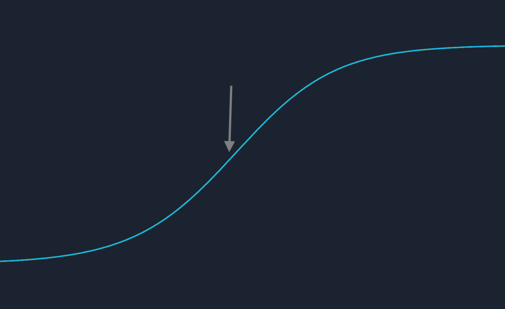
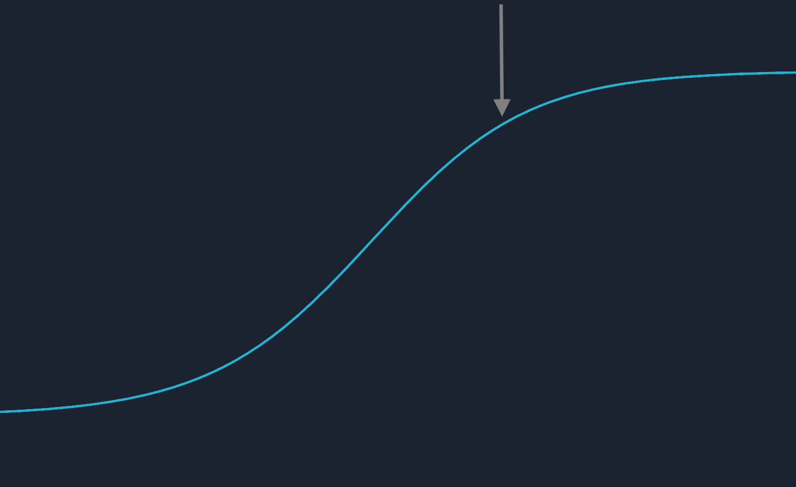
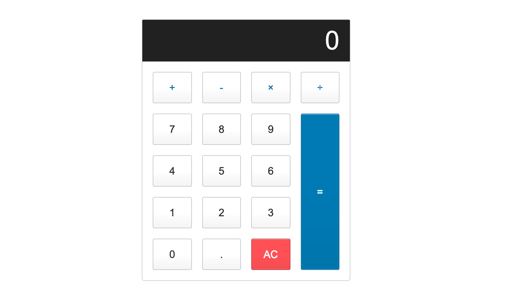

I think all programmers are self-taught&mdash;even university graduates with computer science degrees. As a career, programming requires constant learning. It's vast and continually changing. At some point, every developer will need to teach themselves a new language or technology to solve a problem they have at hand. This makes knowing how to self-teach a valuable skillset.

When I'm asked the best way to learn how to program, I always say the same thing: Try self-teaching. Before spending thousands of dollars on a boot camp, try teaching yourself for one month. Challenge yourself&mdash;see if you can learn how to code on your own. At the end of the month, evaluate your progress.

1.  Have you completed your curriculum?
2.  Did you study consistently?
3.  Do you enjoy programming?

How you answer these questions will determine if you should continue. Remember, it doesn't matter if you [**learn programming at a boot camp**](https://www.wittenbrockdesign.com/blog/i-dropped-out-of-my-coding-boot-camp) or on your own. Mastery is what matters, not how you get there.

I taught myself how to program for ten months before landing my first job. Here are a few tips that made me successful at self-teaching.

## Research the job market 

It's important to know what languages and frameworks are in demand. Before beginning a programming course, spend a few days researching what companies want.

Check out jobs on [**LinkedIn**](https://www.linkedin.com/), [**Indeed**](https://www.indeed.com/), [**Glassdoor**](https://www.glassdoor.com/Job/index.htm), and [**AngelList**](https://angel.co/). Notice the amount of experience a job requires. Try finding positions that want one to three years of experience. This is the sweet spot for junior developers.

Of course, it's great if you already know which language you want to learn. But you should still research the job market. Studying the market now will ensure that you're prepared when you start looking.

## Develop a daily rhythm

I studied programming like it was a full-time job. Monday through Friday, 8 am to 4 pm, I was at the library coding. I even sat at the same desk. This consistent routine was the key to my success.

Staying consistent sounds easy, but it was the most challenging part of self-teaching. If I wanted to play hooky and drive to the beach with my friends, I could. If I wanted to leave early on a Friday, I could. I was the only one holding myself accountable.

The bottom line&mdash;if you lack the discipline to study consistently, I wouldn't recommend self-teaching.

## Track the time you spend studying

In ten months, I spent 1,458 hours programming. I tracked every hour as if I were a freelancer billing a client. I did this for three reasons:

1.  It kept me honest.
2.  It showed me the number of hours I studied per day.
3.  It showed me how long it took to learn something.

While I was at the library for eight hours a day, I wasn't studying the entire time. I took coffee breaks, ate lunch, and had a mid-afternoon nap. Knowing this, it would be dishonest to report that I worked for eight hours a day. My goal was to study for a minimum of six hours every weekday. Timing myself ensured that I was honest with how much work I put in.

## Stay uncomfortable

A common pitfall of self-teaching is stagnation. At a boot camp or university, there are final exams, group projects, and weekly tests. Like running on a treadmill, boot camps and universities are learning environments designed to push you forward.

For better or worse, self-teaching lacks this forward momentum. The upside of this is that you have time to walk through your studies (instead of run), allowing for more in-depth learning. The downside is that it's easy to stay in the same place with nothing forcing you forward.

Let's say you start learning JavaScript. The beginning is brutal. You spend hours in exasperation trying to learn the language. However, while you spend most of your time frustrated and confused, your rate of learning in the beginning is exponential.

After a period of continued study, you reach an inflection point&mdash;things begin to get more comfortable. Less of your time is spent googling, and more of it is spent programming. The periods of confusion are shorter and your 'Ah-ha!' moments of insight are more frequent. However, this is also where your rate of learning slows. In the beginning, you might have been learning dozens of things a day, but now it's only a few.

Eventually, you reach a point of mastery. When you started, JavaScript felt unfamiliar and new, like staying in a hotel room. Now it feels like home. You still run into problems, but most of the time you're in your comfort zone.

This is where stagnation can creep in.

Instead of moving on from JavaScript and learning a new framework or language, you continue to build projects with just JavaScript. Like hiking a hill, learning something new has a subtle resistance. While mastery is essential, it's also important to learn multiple tools, languages, and frameworks to become an effective programmer.

## Create a curriculum

Building the curriculum was my favorite part of self-teaching. Instead of being told what to learn as I had been in school, I let my curiosity guide me.

At the start of your curriculum, I'd recommend studying a course focused on programming fundamentals. A reputable one is [**Harvard's CS50**](https://online-learning.harvard.edu/course/cs50-introduction-computer-science?delta=0). Learning the fundamentals is more important than learning a popular language. [**Languages go in and out of vogue**](https://www.youtube.com/watch?v=Og847HVwRSI), but [**the fundamentals will stay relevant your entire career**](https://www.youtube.com/watch?v=ZZUY37RQS-k).

After completing a fundamentals course, begin studying one language. At this stage, I'd suggest staying away from books. Hours on the keyboard are paramount. After you've had several hundred hours of active programming experience, books and theory will become more relatable and valuable. Right now, look for courses with hands-on learning like [**FreeCodeCamp's JavaScript lessons**](https://www.freecodecamp.org/learn/javascript-algorithms-and-data-structures/).

With a language under your belt, it's time to start making stuff. This is where deeper learning happens. For example, try programming a calculator *on your own* without looking at any tutorials. After you've finished, then you can consult examples and tutorials to see how you can improve.

Continue this two-step process: Pick a course that teaches a technology and then build projects with it. If you repeat these steps, you'll have a solid portfolio of projects and a diverse set of tools hanging from your belt.

## Keep projects simple

A common criticism of junior developers' portfolios is that they all feature the same projects: a to-do list, a calculator, a tic-tac-toe game, etc. You'll often hear that you should stay away from building these generic projects; you should make original ones instead.

I agree that original projects are essential. But I also think there's merit to making a calculator and a to-do list. These generic projects are popular because they're simple in scope and focus on the fundamentals. Starry Night wasn't Vincent van Gogh's first painting&mdash;hundreds came before it.

My advice: create a portfolio with one or two original projects that are simple. I would caution against projects that take more than three weeks of concerted effort to finish. Worse than a portfolio of generic projects is one with many that are half-finished. Companies are looking for programmers who can ship code, not give up when things get tough.

## Join a community

While I advocate self-teaching, I don't support isolated learning. It's important to surround yourself with peers who are learning to program. Your peers can introduce you to new concepts and technologies, expediting your learning. Furthermore, when you get your first job, you'll be part of a team. In a company, learning how to communicate effectively and work in harmony with others is just as important as the code you create.

There are several ways to join programming communities. The best way is through [**Meetup**](https://www.meetup.com/). Search for groups related to programming. In my case, I went to the local FreeCodeCamp Meetup in my area every week. I asked questions, made friends, and had professional developers review my code.

If you don't have access to local Meetups, I recommend [**Chingu**](https://chingu.io/). On this website, you team up with other developers to work on a project together. This is a great way to experience what it's like to work on a development team before getting your first job.

## Believe in yourself

As you progress in your studies, you'll begin to wonder if you should start applying to jobs. If you think you're ready, set a fixed amount of time to job hunt and see what kind of response you get&mdash;like a litmus test.

If you get multiple interviews and make it to a final round&mdash;congratulations, you're job ready! Continue applying until you get an offer that excites you.

On the other hand, you might not get any interviews. That's okay! If that's the case, spend a few more months improving your skillset and enhancing your portfolio. If you stay patient and continue investing time into programming, you'll eventually land a job.

You could also end up somewhere in-between. If you get a few interviews but didn't make it to a final round, you're very close to being job-ready. You'll have to decide if you want to continue job hunting or return to studying.

It's easy to doubt yourself and your capabilities while job hunting. Looking at a posting's long list of requirements makes even experienced developers feel inadequate. Try to ignore these doubts and fears.

Instead, focus on how far you've come. Think back to when you just started learning to program. The languages and technologies that you struggled to understand are now entirely within your grasp. Take a moment to reflect on all that you've accomplished; this is your history of success. Getting your first job will be another accomplishment in this timeline.
