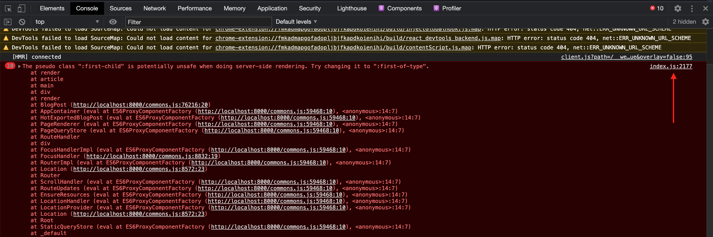
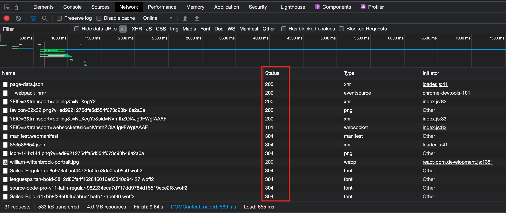
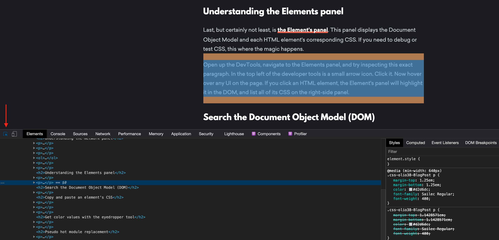
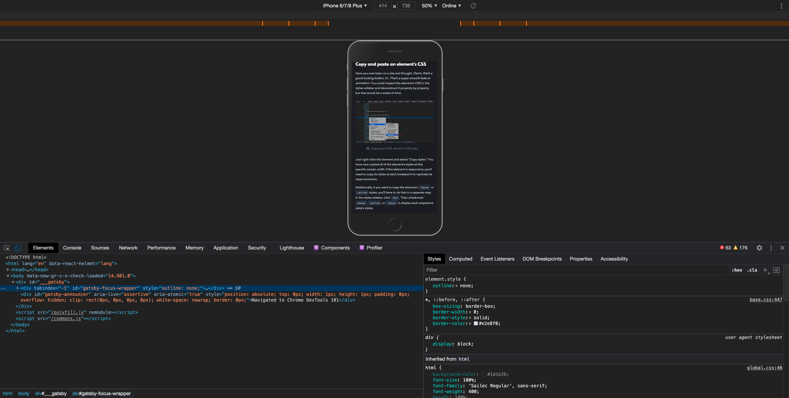
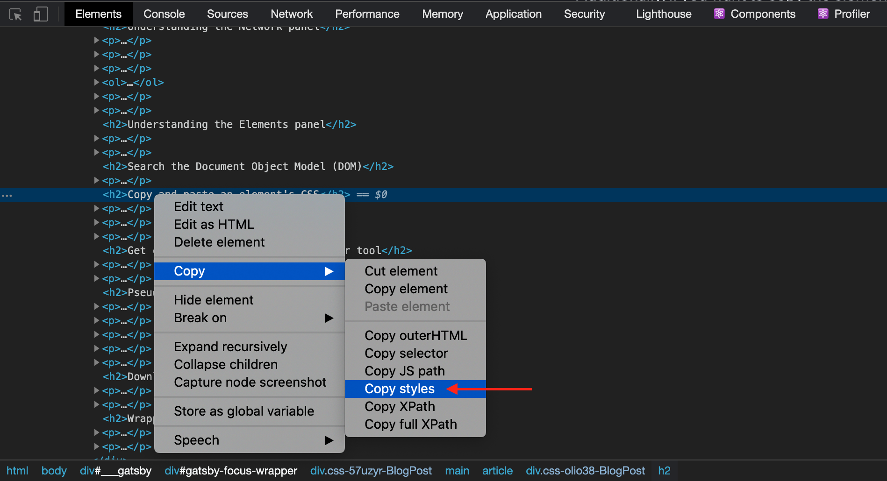
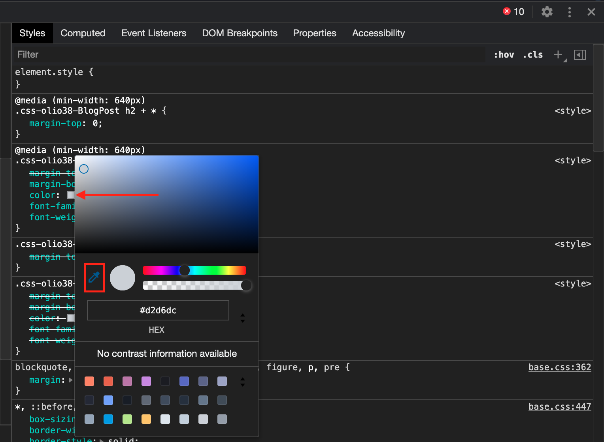
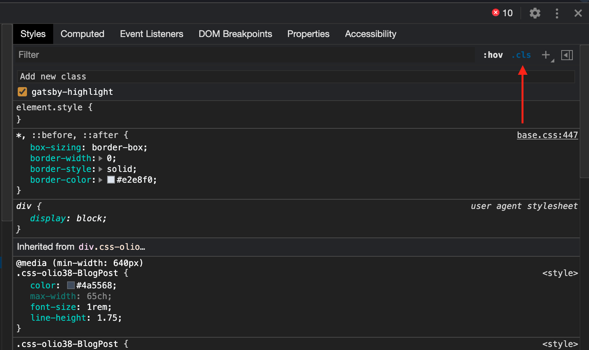
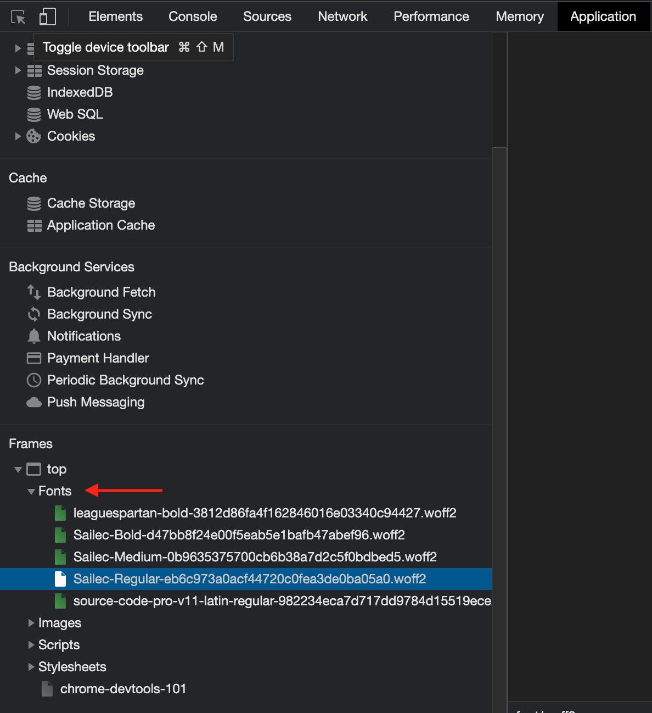

The Chrome DevTools is a web developer's Leatherman. When I first opened the DevTools, I didn't know what I was looking at, and I didn't realize how vital they were. This post is a letter to my younger self. Here's what I wished I had known when I first inspected an element.

I've written this post to be interactive. Pop open the DevTools and follow along with me; you learn better by doing. To open the developer tools, hold down <kbd>option</kbd> + <kbd>command</kbd> + <kbd>i</kbd> on Mac and <kbd>control</kbd> + <kbd>shift</kbd> + <kbd>i</kbd> on Windows.

Boom. We're hacking the mainframe now.

## Understanding the Console

[The Console panel](https://developers.google.com/web/tools/chrome-devtools/console) does two things: display error messages and run JavaScript.



When you get a bug, the first thing you should do is check the Console. To learn more about an error, click the white link to the right of the message. Usually, the Console will point to the line where the interpreter has failed, making it easy to fix bugs. The Console panel also displays `console.log()` statements during run time, appearing in the order declared.

In addition to error handling, the Console doubles as a JavaScript interpreter. For example, try running the script below or writing your own:

```javascript
const addFive = number => number + 5;

addFive(5); // => 10
```

You're probably thinking, _Hey, this is neat and all, but I'll never actually run JavaScript in the Console like this_. Yeah - I agree it's more convenient to run scripts in Node.js or your local environment. However, the Console is the best place to run Document Object Model APIs like `document.querySelector()` and `document.getElementById()`. Testing [DOM APIs](https://developer.mozilla.org/en-US/docs/Web/API/Document_Object_Model) in the Console before adding them to my programs ensures that I target the exact elements I want. For example, let's say I want to create a script that turns all of a page's `h2` tags orange.

```javascript
// Assign all of the page's h2 tags to a variable
const subheadings = document.getElementsByTagName('h2');

// Convert the HTMLCollection to a JavaScript array,
// then loop through each h2 tag
[...subheadings].forEach(subheading => (subheading.style.color = 'orange'));
```

If you ran the above expressions in the Console, you'd notice that all of the page's `h2` are orange now - neat, it looks like our `.getElementsByTagName()` expression worked!

## Understanding the Network panel

In addition to the Console, the second place to check when debugging is [the Network panel](https://developers.google.com/web/tools/chrome-devtools/network/issues). The Network panel's primary purpose is to display the resource requests a site makes; you can quickly see if a website is successfully downloading its scripts, images, fonts, and other resources. You can also inspect individual resource requests and view its HTTP headers, content, size, and additional information.

When you first open the Network panel, it might be empty. Refresh the page with the Network panel open, and the panel will populate with requests.



Each resource request has a corresponding [HTTP response status code](https://developer.mozilla.org/en-US/docs/Web/HTTP/Status). Inside the Status column are a series of numbers ranging from 100 to 599. Each status code has a specific meaning. Here's a breakdown of the five types of status codes.

1. Informational responses (100–199)
2. Successful responses (200–299)
3. Redirects (300–399)
4. Client errors (400–499)
5. Server errors (500–599)

400 and 500 status codes are the banes of a web developer's existence. A 400 error generally means that something went wrong with your frontend code. For example, your fetch request may have a syntax error, your API key could be incorrect, or you might be hitting the wrong endpoint.

[500 errors are harder to troubleshoot](https://www.digitalocean.com/community/tutorials/how-to-troubleshoot-common-http-error-codes). 500 status codes can be a very general error, almost as vague as saying something like, "There's a problem." With 500 errors, something on the server is denying your resource request. It could be possible that the request's headers are incorrect, a CORS issue, or there's an error with the endpoint on the server. If you own and control the web server, now is an excellent time to open its error logs and try to sleuth around to Sherlock what's wrong.

## Understanding the Elements panel

Last, but certainly not least, is [the Element's panel](https://developers.google.com/web/tools/chrome-devtools/css). This panel displays the Document Object Model and each HTML element's corresponding CSS. If you need to debug or test CSS, this where the magic happens.



Open up the DevTools, navigate to the Elements panel, and try inspecting this exact paragraph. In the top left of the developer tools is a small arrow icon. Click it. Now hover over any UI on the page. If you click an HTML element with the inspector arrow, the Element's panel will highlight it in the DOM, and list all of its CSS styles on the right sidebar.

The CSS styles shown in the right sidebar are organized by their [Specificity Hierarchy](https://www.smashingmagazine.com/2007/07/css-specificity-things-you-should-know/). Styles at the top of the sidebar are the most specific; styles at the bottom are the least specific. The sidebar also shows styles the HTML element has inherited and where they inherited them from. If you're having problems getting a CSS style to stick (the HTML element seems to ignore your styles), take a look at this sidebar - your styles might be getting overwritten.

## Simulate mobile and tablet devices

It's 2020 - every user interface you engineer needs to be responsive; you've got to make them look good on the smallest iPhone and the largest 8K television. Luckily, it's easy to see what a website looks like with the DevTool's Device Mode.



Switch to Device Mode by clicking the icon to the right of the inspector arrow; you're now in Device Mode. Device Mode defaults to Responsive. This means that you can resize the web page to any dimension you desire. If you want to view the site from a specific device, click the drop-down in the browser's top center. Then, select a device that you want to virtualize.

Device Mode is a great way to make sure your site looks good on every viewport, but it's not perfect. Device Mode is more of an estimate of what you'll get rather than a one-to-one replica. Experience has taught me that there's about a fifty to one-hundred-pixel deviation from the DevTools to reality. If you're engineering a user interface that needs to look good on a specific device, you'll need to test the UI on the actual device, not the DevTools.

## Search the Document Object Model (DOM)

If you ever want to search the page's DOM, open up the Elements tab and hold down <kbd>command</kbd> + <kbd>f</kbd> on Mac or <kbd>control</kbd> + <kbd>f</kbd> on Windows. These hotkeys will open a search bar that allows you to search the entire DOM. This is useful for finding a specific CSS class or understanding when and where a page loads a specific `<script>`.

## Copy and paste an element's CSS

Have you ever been on a site and thought, _Damn, that's a good looking button_. Or, _That's a super smooth fade-in animation_. You could inspect the element's CSS in the styles sidebar and deconstruct it property by property, but that would be a waste of time.



Just right-click the element and select "Copy styles." You have now copied all of the element's styles at this specific screen width. If the element is responsive, you'll need to copy its styles at each breakpoint to replicate its responsiveness.

Additionally, if you want to copy the element's `:hover` or `:active` styles, you'll have to do that in a separate step. In the styles sidebar, click `:hov`. Then checkmark `:hover`, `:active`, or `:focus` to display each respective state's styles.

Inspecting and deconstructing beautiful CSS that you come across is a great way to improve your CSS; learn from the masters.

## Get color values with the eyedropper tool

You can use the eyedropper tool to get the value of any color on a website. First, inspect an HTML element with a color property. If you inspect this exact paragraph, you'll notice that its `color` property is `rgb(210, 214, 220)`.



Here's the trick - click the color swatch adjacent to the RGB value; a color picker menu pops up. With the eyedropper tool active, you can select any element on the page to find its color value.

## Pseudo hot module replacement

I've worked on projects without [hot module replacement](https://webpack.js.org/concepts/hot-module-replacement/) or LiveServer. Every time I made code changes on these projects, I had to clear the site's cache and refresh the browser. When building complex UI over several hours, this becomes a tedious and tiring ritual.

To get around this, I made my edits in the DevTools before adding them to my project's files. You can edit the HTML of any website by right-clicking an element and selecting "Edit as HTML." Give it a try - change this section's title **Pseudo hot module replacement** from an `h2` tag to an `h3` tag.



You can also add CSS classes to any element on the page. With an element selected, click the `.cls` button in the styles sidebar; it now displays all of the element's classes with corresponding checkboxes. In the "Add new class" input, type a CSS class to add to the element. Testing CSS classes like this pairs perfectly with Tailwind's utility system because it instantly shows how the CSS styles an HTML element.

Similarly, you can add inline styles to any element on the page. Within the `element.style {}` brackets, you can enter any CSS property and value pair. For example, try changing this paragraph's `color` and `font-size`.

One thing to note - the CSS you enter in the `element.style {}` brackets is inline CSS. Inline-styles have the highest specificity on the Specificity Hierarchy overriding both IDs and classes. If you bundle the inline styles that you've tested in `element.style {}` into a CSS class, you might get unexpected results. This CSS class that you just wrote has a lower specificity; its properties might be overwritten by CSS with higher specificity. In short, styles you declare in `element.style {}` do not have the same specificity as styles in CSS classes.

## Download a website's fonts

You can download any website's font files with the DevTools. Now, I should say that you shouldn't use unlicensed fonts on published sites - that's stealing. However, it's a big bummer to buy a font for $60 only to realize it didn't look as great as you had hoped. I think it's valid to try out unlicensed fonts this way before purchasing them.



Open up the DevTools and click the Application panel. Scroll to the sidebar's bottom and expand the "top" menu located beneath the Frames heading. You'll see a list of folders, one of which is titled "Fonts." Expand the "Fonts" folder, and you'll be able to download any of the fonts by double-clicking it.

## Wrapping up

The DevTools expand far beyond what I've covered in this post. For starters, I didn't explain the Lighthouse or Performance panels. If this post has sparked further curiosity beyond what I covered, I recommend doing a deep dive and reading [Google's official docs](https://developers.google.com/web/tools/chrome-devtools).

The next time you're on a favorite website, open the DevTools. Pop open the hood, inspect the engine, and get your hands greasy. Maybe you'll learn something.
