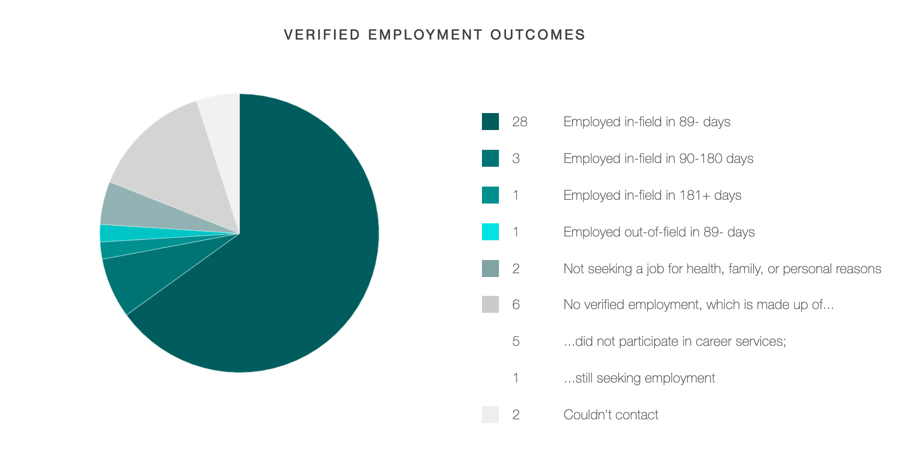

Five weeks after enrolling, I dropped out of my web development boot camp. Like a shoe that was two sizes too small, learning at a boot camp just wasn't a good fit. So, I decided to teach myself how to program. Nine months later, I was working as a full-time web developer.

Despite dropping out, I think boot camps have their merits. But, they also have plenty of flaws. If you're thinking about enrolling in one, here are my takeaways.

## Guaranteeing that you'll do the work

Several co-workers and friends have said that they could never learn to program on their own. Boot camps are useful tools in this regard - they hold you accountable. If you enroll, you will study for eight hours a day, five days a week, for six months straight. Boot camps keep you honest about how much time you're putting in. Learning takes time, and boot camps make sure you stay invested.

## A boot camp's reputation can be an asset

You've probably heard it's easy to get a job programming. This is true for experienced developers. If you have five or more years of professional experience, then yeah, the world is your oyster. As a new developer, I've got some bad news for you: getting your first job will be hard. Most companies see junior developers as a liability. Graduating from a boot camp doesn't guarantee you a job, but it can make finding one easier.

A boot camp's notoriety can help you get hired. Reputable ones will be known for producing capable developers. In many cases, local companies will have hired alumni from your boot camp. Ideally, these alumni will have produced excellent results. So, when you start sending out your resume, managers and recruiters will view you as a less risky investment. Before you enroll in a boot camp, do your homework and make sure that you choose a reputable one. Don't enroll in a certificate farm.

## Getting hired through an internship

Better than a boot camp's reputation is their internship program. Good boot camps have internship programs. Take a moment to think about hiring from a manager's perspective. Managers are looking for someone who can fill skill gaps and reduce workload. Hiring an incapable developer does neither of these things. Now the manager has three problems: skill gaps, high workload, and someone on their team who's dead weight. Furthermore, bad hires reflect poorly on the managers who hire them.

Just as hiring managers are trying to weed out the bad apples, they're also looking for diamonds in the rough. Companies are looking for developers with rookie of the year material; these are people early in their careers who are capable, curious, and optimistic. They're playmakers who solve problems, and they're cheap in comparison to their senior counterparts. This is why internships are so valuable. Hiring is about mitigating risk. Internships are how you prove that you're an asset, not a liability.

## Gaining support from your peers

Changing careers and learning how to program takes thousands of hours - it's a long journey. Staying motivated will be difficult. However, the peers in your boot camp's cohort can motivate you. Boot camps are rigorous and stressful; there's nothing easy about them. When times get tough, and they inevitably will, you won't be alone. You can lean on your peers for support and help.

## The high cost of tuition

In nine months of self-teaching, I spent $75 on books and courses. If I had completed a six-month boot camp, I would have spent $10,000 on tuition. The truth is everything you need to become a professional web developer is available for free online. If you have the time, patience, and discipline, you can teach yourself how to program without paying thousands of dollars.

## Learning from inexperienced teachers

Boot camps can have great teachers. They can also have teachers without professional experience. Some boot camps hire their alumni right after they graduate, which is a practice that benefits boot camps in several ways. First, it's cheap. New boot camp grads are cheaper than experienced developers. Second, it's fast. Boot camp alumni already know the curriculum, so the school doesn't have to spend time onboarding. Finally, it helps the school boost its job placement rating.

While these upsides are great for the boot camp, they aren't you; a teacher with six months of experience isn't worth the thousands of dollars you're paying. My advice: look up the boot camp's instructors on LinkedIn. Make sure they have several years of professional development under their belt before you enroll.

## You might get left behind

On the first day of my boot camp, there were 42 students. Five weeks later, there were 19. Six months later, when the cohort graduated, there were 16. Boot camps have cutthroat curriculums. They love to advertise that you can learn web development in 24-weeks. What they don't promote is their shocking drop out rates.

Here's the problem - boot camps don't let you learn at your own pace. This the main reason why I dropped out. I knew I could learn JavaScript, just not in three weeks. Each day I'd leave the boot camp feeling as though I was falling farther and farther behind; I started to believe I wasn't cut out for programming. Looking back on it now, my doubts were ridiculous. Not many people who are new to programming can grasp the fundamentals in a few weeks. If you enroll in a boot camp and start doubting your abilities, stop. Don't listen to those thoughts - never question your intelligence. With enough time and dedication, you can learn anything.

## Feeling like an imposter

Your cohort will have students with a wide range of programming capabilities. There'll be students who show up on the first day with zero programming experience. There will also be students with STEM degrees who already know Boolean logic and are comfortable writing Algebraic expressions. You might even have students with professional programming experience. This broad spectrum of abilities will lead to a student hierarchy; there will be students at the top who will quickly grasp the material and finish the day's lesson early. Most students will be somewhere in the middle, keeping up with the curriculum but not exceeding it. And a few students will lag behind, slowly getting outpaced until they drop out.

If you're the type of person who often compares themselves to others, this hierarchy is a distraction. When you compare yourself to talented people, it's easy to doubt yourself. These thoughts are toxic. Like rust eating at an engine, they erode your curiosity and motivation. When it comes to learning, it doesn't matter what your peers' capabilities are; you're not competing against them. The only thing that matters is your level of understanding. That's what you should focus on.

## Choosing the right shoe

I'm a boot camp drop out. I blame the expensive tuition and fast pasted curriculum. Ultimately, I didn't like 'finishing' a section that I hadn't really mastered. Despite these criticisms, I am glad I tried it. I think boot camps, university, or self-teaching are all viable options. It's important to remember that none of them are perfect. What matters is which one is the best fit.
