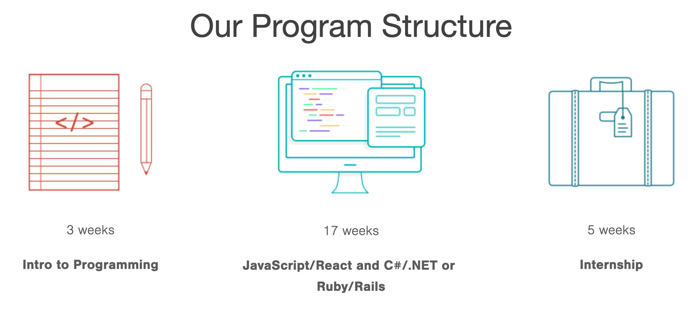
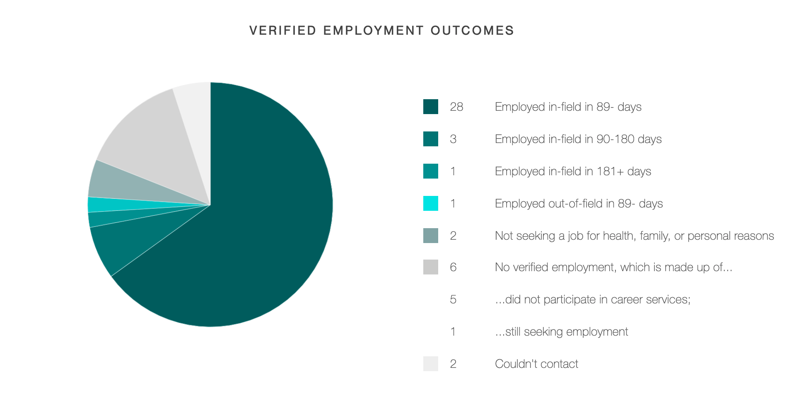

Five weeks after enrolling, I dropped out of my web development boot camp. Like a shoe that was two sizes too small, the boot camp just wasn't a good fit. So, I decided to teach myself how to program. Nine months later, I was working as a full-time web developer.

Despite my experience, I think boot camps have their merits. But they also have plenty of flaws. If you're thinking about enrolling in one, here are my takeaways.

## Guaranteeing that you'll do the work

Several co-workers and friends have said that they could never learn to program on their own. Boot camps are useful tools in this regard&mdash;**they hold you accountable**. If you enroll, you will study for eight hours a day, five days a week, for six months straight. Boot camps keep you honest about how much time you're putting in and ensure you stay invested.

## A boot camp's reputation can be an asset

You've probably heard it's easy to get a job programming. This is true for *experienced developers*. If you have five or more years of professional experience, then yeah, the world is your oyster. **As a new developer, I've got some bad news for you: getting your first job will be hard**. [Most companies see junior developers as a liability](https://medium.com/@melissamcewen/who-killed-the-junior-developer-33e9da2dc58c). Graduating from a boot camp doesn't guarantee you a job, but it can make finding one easier.

**A boot camp's notoriety can help you get hired**. In many cases, local companies will have hired alumni from your boot camp. Ideally, they will have produced excellent results, and managers and recruiters will view you as a less risky investment. Before you enroll in a boot camp, do your homework and make sure that you choose a reputable one. Don't enroll in a certificate farm.

## Getting hired through an internship

Better than a boot camp's reputation is its internship program. **Good boot camps have internship programs**. Take a moment to think about hiring from a manager's perspective. Managers are looking for someone who can fill skill gaps and reduce workload. Hiring an incapable developer does neither of these things; it just leaves the manager with an employee who's dead weight. Furthermore, a bad hire reflects poorly on the manager who hires them.

Companies are looking for developers who are rookie of the year material, people early in their careers who are capable, curious, and optimistic. They're playmakers who solve problems, and they're cheap in comparison to their senior counterparts. **Internships are how you prove that you're an asset, not a liability**.

## Gaining support from your peers

Changing careers and learning how to program takes thousands of hours, and staying motivated will be difficult. **However, your boot camp peers can motivate you**. Boot camps are rigorous and stressful, and when times get tough, as they inevitably will, you won't be alone. You can lean on them for support and help.

## The high cost of tuition

**In nine months of self-teaching, I spent $75 on books and courses**. If I had completed a six-month boot camp, I would have spent $10,000 on tuition. The truth is everything you need to become a professional web developer is available for free online. If you have the time, patience, and discipline, you can teach yourself how to program without paying thousands of dollars.

## Learning from inexperienced teachers

Boot camps can have great teachers. **They can also have teachers without professional experience**. Some boot camps hire their alumni right after they graduate&mdash;for several reasons:

1.  It's cheap. New boot camp grads are less expensive than experienced developers.
2.  It's fast. Boot camp alumni already know the curriculum, so they don't have to spend time onboarding.
3.  It helps the school boost its job placement statistics.

While these upsides are great for the boot camp, they aren't great for you; a teacher with six months of experience isn't worth the thousands of dollars you're paying. My advice: look up the boot camp's instructors on [LinkedIn](https://www.linkedin.com/). Make sure they have several years of professional development under their belt before you enroll.

## You might get left behind

On the first day of my boot camp, there were 42 students. Six months later, there were 16 graduates. **Boot camps have cutthroat curriculums**. They love to advertise that you can learn web development in 24 weeks. What they don't advertise is their shocking dropout rates.

Here's the problem&mdash;**boot camps don't let you learn at your own pace**. This the main reason I dropped out. I knew I could learn JavaScript, just not in three weeks. Each day I felt as though I was falling further and further behind; I started to believe I wasn't cut out for programming. Not many people who are new to programming can grasp the fundamentals in a few weeks. If you enroll in a boot camp and start doubting your abilities, stop. Never question your intelligence. With enough time and dedication, you can learn programming.

## Feeling like an imposter

Your boot camp cohort will have students with a wide range of programming capabilities. There'll be students who show up on the first day with zero programming experience. There will also be students with STEM degrees who already know [Boolean logic](https://en.wikipedia.org/wiki/Boolean_algebra) and are comfortable writing algebraic expressions. Some might even have professional programming experience. This broad spectrum of abilities creates a student hierarchy; those at the top will quickly grasp the material and finish the day's lesson early. Most will be in the middle, keeping up with the curriculum but not exceeding it. And a few students will lag behind until they drop out.

If you're the type of person who compares themselves to others, this hierarchy is a distraction. **When you compare yourself to talented people, it's easy to doubt yourself**. These comparisons are toxic. Like rust eating at an engine, they erode your curiosity and motivation. You're not competing against your peers. The only thing that matters is finding a learning process that fosters growth and leads to success. That's what you should focus on.

## Choosing the right shoe

I'm a boot camp dropout. I blame the expensive tuition and fast-paced curriculum. Ultimately, I didn't like "finishing" a section that I hadn't really mastered. Despite these criticisms, I am glad I tried it. I think boot camps, university, or self-teaching are all viable options. It's important to remember that none of them are perfect. What matters is which one is the best fit.
